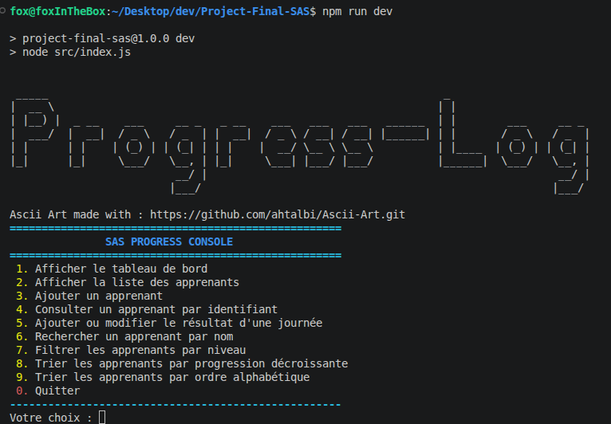

# ProgressLog — SAS Progress Console

## Preview

## Contexte
- Console de suivi de progression pour apprenants fictifs (SAS JavaScript, YouCode)
- Les niveaux affichés sont des repères, pas une décision d'admission

## Architecture (couches)
- `data/messages.js` : textes statiques du menu
- `helpers/validators.js` : validation des entrées utilisateur
- `students.js` : logique métier (apprenants, calculs, tri, filtre)
- `index.js` : menu et boucle d'interaction, aucun calcul

## Données
- Apprenant : id, nomComplet, ville, resultats
- Résultat : jour (1-7), exercicesTermines, totalExercices, challengeTermine

## Fonctionnalités
- Tableau de bord
- Liste des apprenants
- Ajouter un apprenant
- Consulter par identifiant
- Ajouter/modifier un résultat
- Rechercher par nom
- Filtrer par niveau
- Trier par progression décroissante
- Trier par ordre alphabétique

## Niveaux
- Solide : à partir de 80%
- En progression : 50% à 79%
- À renforcer : moins de 50%

## Lancement
- `npm run dev`

## Tests
- 5 scénarios minimum

## Conventions
- Total proposé nul → progression = 0%
- Pourcentages arrondis à 2 décimales
- Recherche par nom insensible à la casse
- Mise à jour d'une journée remplace l'entrée existante
- Tri alphabétique via localeCompare